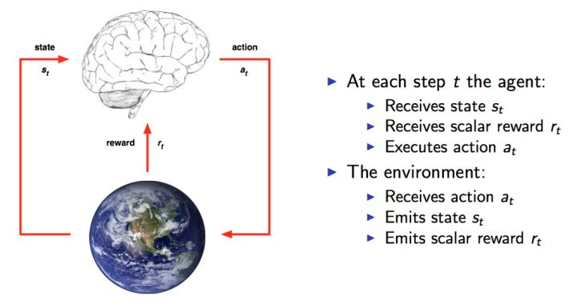
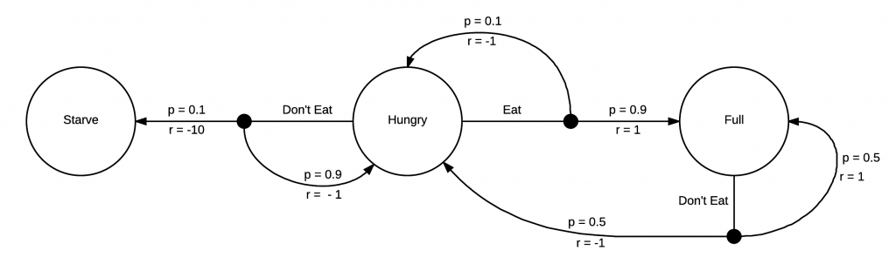

# RL-02 马尔科夫决策过程&动态规划

*Arthur  2020 / 21 / 05*

## RL基本概念



根据上图, 任务的目标就是: 获取尽可能多的 $Reward$ . 每个时间片, 智能体根据当前的状态, 来确定下一步的动作, 即需要一个 $state$ 找出一个 $action$ , 使得 $reward$ 最大. 这里的从 $state$ 到 $action$ 的过程就称之为一个策略 $Policy$, 一般用 $\pi$ 表示. 

 **RL的任务就是找一个最优的策略 $Policy$ 从而使 $Reward$ 最多.**

在运行RL的算法之前, 首先需要得到一系列的 $state, action, reword $ , 这个过程通常是智能体随机得到的, 是一系列的样本, 如下:

$(s_1, a_1, r_1, s_2, a_2, r_2, \dots, s_t, a_t, r_t )$

RL的算法就是根据这些样本来改进 $Policy$ , 从而使得样本中的 $Reward$ 更好, 这种算法具有让 $Reward$ 越来越好的特性, 因此被称为强化学习(Reinforcement Learning).

## 马尔科夫链 ( Markov Chain)

- 马尔科夫特性： 只依赖当前状态来预测下一个状态，而与之前的状态无关。
- 马尔科夫表： 用表的形式来表示状态转移到下一个状态的转移概率。

| 当前状态 | 下一个状态 | 转移概率 |
| -------- | ---------- | -------- |
| 多云     | 下雨       | 0.6      |
| 下雨     | 下雨       | 0.2      |
| 晴天     | 多云       | 0.1      |
| 下雨     | 晴天       | 0.1      |

## 马尔科夫决策过程 ( Markov Decision Process)

- 马尔科夫决策过程实际上是对环境的建模, 它与马尔科夫链的区别是加入了 $action$ 和 $rewards$ 的概念: 
- 一个基本的MDP可以用一个五元组来表示 ( $S, A, P, R, \gamma $ ):
  - 智能体所处的一组状态（S）
  - 智能体从一组状态转移到另一组状态所执行的一组行为（A）
  - 转移概率（$P_{ss}^{a}$）, 执行某一个行为 $a$ , 从一个状态 $s$ 转移到另一个状态 $s^{'}$  的概率
  - 奖励概率（$R_{ss^{''}}^a$）, 执行某一行为 $a$ , 从一个状态 $s$ 转移到另一个状态 $s^{'}$ 所获得奖励的概率
  - 折扣因子 ($\gamma$) , 控制及时奖励和未来奖励的重要性, fanwei  [0,1] 
- 注: MDP的核心问题, 就是找一个策略 $\pi$ , 来决定在状态 $s$ 下选择哪个动作;  这样, MDP就变成了一个马尔科夫链.

## 奖励

- 智能体追求从环境中获得的总奖励(累计奖励)最大化,而不仅仅是及时奖励.

  $R_t =  r_{t+1} + r_{t+2} + \dots + r_{T}$

- 加入折扣因子之后的奖励和回报:

  $R_t =  r_{t+1} + \gamma r_{t+2} + \gamma^{2} r_{t+2} + \gamma^{3} r_{t+} + \dots + \gamma^{T-(t+1)} r_{T} = \Sigma_{k=0}^{T} \lambda^{k}r_{t+1+k}$

- 若折扣因子为0, 则指挥考虑即时奖励;  若为1, 则会更考虑未来奖励;

## 策略函数

- 策略函数: 策略代表了为达成目标而选择执行的行为, 是从状态到行为的映射, 表示每个状态执行什么行为, 记为 $\pi$:

  $\pi(s): S \rightarrow A $

- 对于一个给定的状态, 所有可能动作的概率函数求和/积分为1:

  $\Sigma_a \pi(s, a) = 1$

- 最终目标是找到一个最优策略,在每个状态都指定正确的行为,从而使奖励最大化;

  

  如上图,当处于”Hungry”状态是, 有两种行为“Eat”或”Don’t Eat”. 朴素的观察, 发现最优策略是”Eat”, 因此此时的最优策略 $\pi^\star$ 可以记作: 

  $\pi^\star (Hungry) = Eat $ 

## 状态值函数

- 简称为值函数, 确定一个智能体在策略 $\pi$ 下处于某一特定状态的最佳程度, 记为 $V(s)$ 表示执行策略后状态的值,  它等价于智能体从状态 $s$ 开始, 经历多个时间步到达终结状态, 所累积获得的奖励期望;

- 在策略 $\pi$ 下, 从状态 $s$ 开始获得的期望回报:

  $V^{\pi}(s) = E_\pi[ R_t | s_t = s ] = E_\pi[\Sigma_{k=0} \gamma^{k} r_{t+1+k} | s_t = s] = E_\pi [ R_t + \gamma V^\pi(s_{t+1}) | s_{t} = s]$
  
  注: 以上公式最后部分, 就是Bellman方程基本形态,  体现的是当前状态的价值和下一步的价值的迭代关系;
  
- 值表: 用表的形式表示不同状态的值(期望回报):

  | 状态  | 值(期望回报) |
  | ----- | ------------ |
  | 状态1 | 0.3          |
  | 状态2 | 0.9          |

  由上表可以得知, 状态2的值较大, 因此状态2优于状态1 , 这意味着当某个状态可以向状态1或2转移时, 转移到状态2将获得较大的回报. 

## 状态-行为值函数

- 也称之为Q函数, 用于表示智能体执行策略 $\pi$ , 在某一个状态执行某一个特定行为 $a$ 的最佳程度, 本质就是回报值. 记为 $Q(s)$ ;

- 根据策略 $\pi$ , 在状态 $s$ 采取行为 $a$ 后,  直到终结状态,  期间多个时间步, 所累积获得的期望回报如下:

  $ Q^\pi (s,a) = E_\pi [ R_t | s_t = s, a_t = a  ] = E_\pi[ \Sigma_{k=0} \gamma^k r_{r_t+1+k} | s_t=s, a_t=a ]  $

- Q表: 用表的形式表示状态下不同行为的值(期望回报)

  | 状态      | 行为      | 值(期望回报) |
  | --------- | --------- | ------------ |
  | **状态1** | **行为1** | **0.03**     |
  | 状态1     | 行为2     | 0.02         |
  | 状态2     | 行为1     | 0.5          |
  | **状态2** | **行为2** | **0.9**      |

  由上表可以得知, 状态1时执行行为1, 状态2时执行行为2具有较大的值(回报), 这意味着当智能体处于状态1或2时, 选择这些行为将获得较大的回报. 

## 状态值函数（值函数）vs 状态－行为值函数（Ｑ函数）

- 值函数：确定的是: 遵循某个策略 $\pi$ , 状态 $s$ 的最佳程度. 此时不涉及行为, 由策略 $\pi$ 决定采取什么行为; 

- Q函数：确定的是: 遵循某個策略 $\pi$ , 在状态 $s$ 下采取行为的最佳程度. 即评估不同的行为 $a$ 的期望回报;

  

  如上图,当处于”Hungry”状态是, 有两种行为“Eat”或”Don’t Eat”. 分别计算这两个行为的单步回报:

  $R_{Eat} = 0.9*1 + 0.1*(-1) = 0.9 $

  $R_{Don't Eat} = 0.9*(-1) + 0.1*(-10) = -1.9 $
  
  因此:
  
  $\pi^\star(Hungry) = Eat$
  
  $V^\star(Hungry) = 0.9$

## 小结:

- 由以上可以看出, MDP问题中, 决定一个智能体的期望回报的, 主要是由上面所说的策略 $\pi$ 和值函数 $V(s)$ 以及Q函数 $Q(s)$ 决定的, 所以, 求解MDP时, 就是寻求最优策略和值函数/Q函数, 最优值函数记为  $V^\star(s)$ :

  $ V^\star(s) = \max_\pi V^\pi (s)$

  由于Q函数是针对一个状态的多个可能行为的回报的表示, 因此Q函数的最优值, 也是值函数的最优值:

  $V\star(s) = \max_\pi Q^\star (s,a)$


## Bellman方程

- 定义符号 $\Rho$  , 根据前面的价值函数, 遍历所有的行为 $a$,  针对每个行为 $a$, 遍历所有可能的下一状态 $s'$ ,计算价值函数, 然后求和, 可以得到价值函数 $V^\pi (s) $  的递推公式如下:

  $V^\pi (s)= \sum_a \pi(s,a) \sum_{s'} \Rho_{ss'}^a [ R_{ss'}^a + \gamma V^\pi (s')]$

  其中:

  - $a$ 代表在状态 $s$ 下, 可以选择的行为;
  -  $\Rho_{ss'}^a$ 代表的是在状态 $s$ 下, 选择行为 $a$ 进入到状态 $s'$  的概率; 
  - $R_{ss'}^a$ 代表的是在状态 $s$ 下, 选择行为 $a$ 后所得到的回报;
  - $\gamma$ 代表的是折扣因子;

- 同理的, Q函数进行类比, 针对已知的行为 $a$, 遍历所有可能的下一状态 $s'$ , 计算Q函数值,  然后求和, 可以得到Q函数 $Q^\pi (s,a)$ 的递推公式如下:

  $Q^\pi (s,a) = \sum_{s'} \Rho_{ss'}^a [ R_{ss'}^a + \gamma \sum_{a'} Q^\pi(s', a') ] $

  其中: 

  -  $\Rho_{ss'}^a$ 代表的是在状态 $s$ 下, 选择行为 $a$ 进入到状态 $s'$  的概率; 
  - $R_{ss'}^a$ 代表的是在状态 $s$ 下, 选择行为 $a$ 后所得到的回报;
  - $\gamma$ 代表的是折扣因子;
  - $a'$ 代表在状态 $s'$ 下, 可以选择的所有的行为;

- 以上两个公式合并( 后者代入前者 ), 可以得到基于Q函数的价值函数的的最优化解 $V^\star(s)$ 为如下问题, 称之为Bellman最优方程:

  $V^\pi (s) = \max_ａ \sum_{s'} \Rho_{ss'}^a [ R_{ss'}^a ＋　\gamma \sum_{a'} Q^\pi (s',a')]  $

## 动态规划

- **动态规划(DP)** : 在动态规划中, 并不是直接求解复杂问题, 而是将问题分解成简单的子问题, 然后对每个子问题计算并保存该解. 如果出现相同的子问题, 则不再重新计算, 而是使用已求得的解.
- 两种算法:
  - 值迭代
  - 策略迭代

### 1. 值迭代

```flow
st=>start: 开始
op1=>operation: 初始化随机值函数 V(s)
op2=>operation: 对于每个状态, 计算 Q(s,a)
op3=>operation: 因为 V(s) = Max Q(s,a), 
用Q(s,a)的最大值更新值函数V(s)
cond=>condition: V(s)最优?
e=>end
st->op1(right)->op2->op3(right)->cond
cond(yes)->e
cond(no)->op2

```

例子:  

- 一开始, 所有的状态 $s$ 的值都是, 即 $V(s_A) = V(s_B) = \dots = 0 $ 
- 假设知道初始状态 $s_A$ 到其他状态的转移概率和奖励( 很多时候转移概率也未知, 且奖励也未知 ) 
- 由已知信息, 可以计算出 $Q(s_A,a_1), Q(s_A,a_2), \dots , Q(s_A, a_k)$ , 即每个行为 $a_k$ 的Q值
- 找到其中最大的, 假设为 $Q(s_A,a_m)$ , 用  $ Q(s_A,a_m) $ 作为状态 $s_A$ 的值, 即 $V(s_A) = Q(s_A,a_m)$