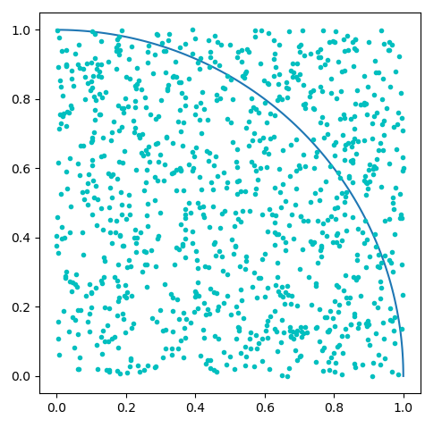

# RL-03 蒙特卡罗方法

*Arthur   May 05, 2020*

[toc]

## 前言

- 什么情况下使用？

  在马尔可夫决策过程和动态规划中， 是已知模型动力学（即转移概率和奖励概率）的。 但如果未知模型动力学时该如何确定策略呢？  此时就要采用蒙特卡罗方法。

- 蒙特卡罗方法介绍：

  蒙特卡罗方法通过随机采样样本来找到近似解。依据是大数定理。

  举例： 

  

在正方形内按均匀分布概率随机产生点，当点数很大时，可知落入1/4圆弧的点的个数与落入正方形的点的个数与其面积成正比， 即：

$$
\begin{align}
\frac{1}{4} \frac{\pi r^2}{r^2} &= \frac{圆弧内点个数}{正方形内点个数} \\
\pi &= \frac{4 * 圆弧内点个数 }{ 正方形内点个数 }
\end{align}
$$

代码如下:

````python
import numpy as np
import math
import random
import matplotlib.pyplot as plt


# 随机产生点x,y, 取值均在范围 [0, size]
def generatePts(size):
    x = random.random() * size
    y = random.random() * size
    return x, y


# 是否在圆内
def isInCircle(pt, r):
    # 到圆心的距离小于半径
    return math.sqrt(pt[0] ** 2 + pt[1] ** 2) <= r


def draw():
    plt.axes().set_aspect('equal')
    arc = np.linspace(0, np.pi / 2, 100)
    plt.plot(1 * np.cos(arc), 1 * np.sin(arc))


def calcPi():
    # 边长
    a = 1
    # 落入园弧的点的个数
    ptsInCircle = 0
    # 落入正方形的店的个数
    ptsInSquare = 0
    # 样本数量
    samples = 1000

    draw()
    for i in range(samples):
        pt = generatePts(a)
        plt.plot(pt[0], pt[1], 'c.')
        ptsInSquare += 1
        if isInCircle(pt, a):
            ptsInCircle += 1

    plt.show()
    # 计算Pi
    return 4 * ptsInCircle / ptsInSquare


if __name__ == '__main__':
    pi = calcPi()
    print('PI is: {} '.format(pi))

````

输出结果:

```shell
PI is: 3.148 
```

## 蒙特卡罗预测

在之前的动态规划中, 可以6用值迭代和策略迭代来求解马尔可夫决策过程问题 ,这些方法都需要转移概率和奖励概率来寻求最优策略. 如果未知转移概率和奖励概率时,  就可以用蒙特卡罗方法.  它需要知道已知状态、行为和奖励的采样序列，然后通过取平均回报而不是期望回报来近似值函数。


蒙特卡洛预测可以估计任何给定策略下的值函数， 具体蒙特卡罗预测的步骤如下：

```flow
st=>start: 开始
op1=>operation: 初始化随机值函数
op2=>operation: 初始化一个用于保存回报的回报列表
op3=>operation: 计算每个场景的回报
op4=>operation: 将所得的回报添加到回报列表
op5=>operation: 取回报平均值作为值函数
e=>end
st->op1->op2(right)->op3->op4->op5->e
```