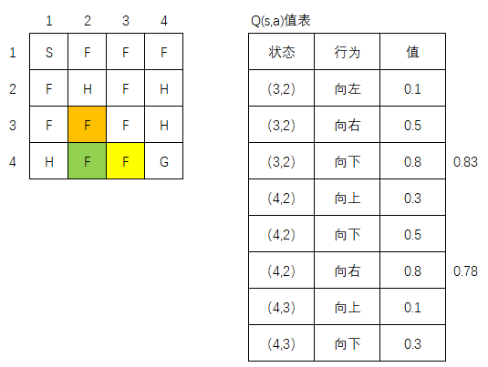
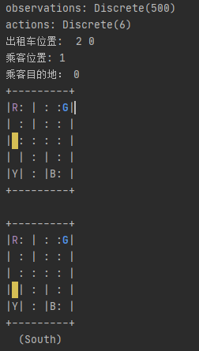

# RL-04 时间差分学习

*Arthur   May 05, 2020*

[toc]

## 时间差分学习

- **简介**

  基于先前的学习的估计值来近似当前估计值， 也成为自举（bootstrapping）。蒙特卡罗方法没有自居，只能在情景结束时才能进行估计。

- **时间差分（TD）更新规则：**

  时间差分学习采用TD更新的规则来更新一个状态的值：

  $V(s) = V(s) + \alpha( r + \gamma V(s') - V(s) )$

  上式本质上 $r + \gamma V(s')$ 与  $V(s)$ 的偏差， 称为时间差分误差， 经过多次迭代， 试图使该误差最小化。其中的 $\alpha$ 称为学习率。

## 时间差分控制

- 简介

  在时间差分预测中， 是估计值函数。 在时间差分控制中， 是优化值函数。有两种控制算法：

  - 离线策略学习算法:  Q学习
  - 在线策略学习算法： SARSA

### Q学习

- Q学习中根据下列方程更新Q值：

  $ Q(s,a) = Q(s,a) + \alpha [r + \gamma maxQ(s',a') - Q(s,a) ]$

  例子： 以冰湖为例，假设当前状态处于(3,2)， 并且具有两种行为（向左或向右），已知的Q值表如图所示。

  

  设选择某一个概率 $\epsilon$ 并探索一中心的向下的行为，到达行的状态（4，2），该如何更新（3，2）的值？ 

  设 $\alpha$ 为0.1， 折扣因子 $\gamma$ 为1， $r$ 为0.3, 则代入公式：

  $ Q(s,a) = Q(s,a) + \alpha [r + \gamma maxQ(s',a') - Q(s,a) ]$  

  后为：

  $Q((3,2),向下) = Q((3,2),向下) + 0.1[ 0.3 + 1*maxQ((4,2),a') - Q((3,2),向下)]$

  查表可知 $Q((3,2),向下)$ 的值为0.8, $maxQ((4,2), a’)$ 为$Q((4，2),向右)$ ，其值为0.8

  所以：

  $Q((3,2),向右) = 0.8 + 0.1[0.3+ 1*0.8 - 0.8] = 0.83$

​		

​		同理， 考虑状态 (4,2), 此时可知向右的行为具有最大值， 则如何更新 Q((4,2), 向右)的值， 同上所述：

​		$Q((4,2),向右) = 0.8 + 0.1[0.3+ 1*0.3 - 0.8] = 0.78$


- 出租车例子：

  - 规则：

    出租车完成任务可以得到20个奖励，每次试图移动一格算作-1奖励（有点像汽车在路上跑烧油的感觉），当乘客不在拉客位置上或者车没开到目的地就让乘客下车时，获得-10奖励

    

代码：

```python
import random
import time
import gym
import numpy as np
import pandas as pd
import matplotlib.pyplot as plt

# 根据公式更新Q值表
def update_q_table(prev_state, action, reward, nextstate, alpha, gamma):
    qa = max([q[(nextstate, a)] for a in range(env.action_space.n)])
    q[(prev_state, action)] += alpha * (reward + gamma * qa - q[(prev_state, action)])

# epsilon 贪婪策略
def epsilon_greedy_policy(state, epsilon):
    if random.uniform(0,1) < epsilon:
        return env.action_space.sample()
    else:
        return max(list(range(env.action_space.n)), key = lambda x: q[(state,x)])


alpha = 0.4
gamma = 0.999
epsilon = 0.017

# 所有轮次的回报
episode_rewards = []

env = gym.make('Taxi-v3')

print("observations:", env.observation_space)
print("actions:", env.action_space)

q = {}
# for s in range(env.observation_space.n):
#     for a in range(env.action_space.n):
#         q[(s, a)] = 0.0
q = np.zeros((env.observation_space.n,env.action_space.n))

for i in range(2000):
    r = 0
    prev_state = env.reset()
    taxirow, taxicol, passloc, destidx = env.unwrapped.decode(prev_state)
    #print("出租车位置: ",taxirow, taxicol)
    #print("乘客位置:", passloc)
    #print("乘客目的地：", destidx)

    while True:
        # env.render()
        # 根据贪婪策略， 选择一个行为
        action = epsilon_greedy_policy(prev_state, epsilon)
        # 执行行为，得到下一个状态，以及奖励
        nextstate, reward, done, _ = env.step(action)
        # 更新下一个状态来Q值表
        update_q_table(prev_state, action, reward, nextstate, alpha, gamma)
        # 更新总奖励值
        r += reward
        # 转换到下一个状态
        prev_state = nextstate
        # 判断是否结束
        if done:
            break
        #time.sleep(1)
    episode_rewards.append(r)
    print("total reward: ", r)

print('Q:\n', q)
env.close()

plt.plot(episode_rewards)
plt.show()


```

结果：



6个动作： 东南西北， pick up， drop off

600个状态； 这个坏境的观测是[0-500)的值，出租车的5×5位置；pass_loc乘客位置共有5个，即四个位置等待的状态+在车上的状态；destination有4个，表示目的地，全部状态总数是(5×5)x5x4=500


可以看出总体的rewards在训练2500次以上后就收敛到-10左右，说明司机能很快的接到乘客并送到目的地。

